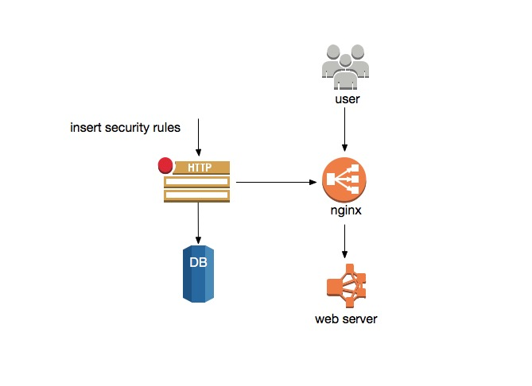

# Description
Napi.goblin is used to forbidden requests from ip blacklist，and pass from uuid whitelist，all rules can be set dynamicly

## 1.1 Ip
Ip: gets from the first part of x-forwarded-for header，if it not exists, gets from socket
## 1.2 Uuid
Uuid: gets “lianjia_uuid” from cookie, if it not exists, gets from “Lianjia-Device-Id” header

* Uuid has two format 
	- 32 length，sample：19bfb7ecbc2c7027cbe57921a69ecf94
	- 36 length，sample：14536622-17fc-11e6-a0fc-fa9e084204dd

## 1.3 Architecture



# 2. API

## 2.1 Add a rule

### 2.1.1 Request
```
Request
POST /nginx/rule/add HTTP/1.1
Content-Type: application/json

{
    "ip": ${ip},                      //string，ip
    "uuid": ${uuid},                  //string，32 or 36 length uuid
    "product": ${product}             //string，product name
    "expire": ${time},                //number，relative time in seconds 
    "punish": ${length 16 string}     //string，punish action
}
```
* Caution: ip and uuid should not be set simultaneously

### 2.1.2 Response
* Success
```
Response
HTTP/1.1 200 OK
Content-Type: text/plain; charset=utf-8
```

* Bad request
```
Response
HTTP/1.1 400 Bad Request Structure
Content-Type: text/plain; charset=utf-8
```

### 2.1.3 sample

* Add ip to blacklist

```
Request
POST /nginx/rule/add HTTP/1.1
Content-Type: application/json
{
	"ip": "10.30.31.1",
	"product": "test", 
	"expire": 60,
	"punish": "captcha"
}
Response
HTTP/1.1 200 OK
Content-Type: text/plain; charset=utf-8
```

* Add uuid to whitelist

```
Request
POST /nginx/rule/add HTTP/1.1
Content-Type: application/json 
{
   "uuid": "c6e57a06-e638-44dc-863c-7f453f6a39eb",
   "product": "test", 
   "expire": 60,
   "punish": "captcha"
}
 
Response
HTTP/1.1 200 OK
Content-Type: text/plain; charset=utf-8
```

## 2.2 Delete

### 2.2.1 Request

```
Request
POST /nginx/rule/delete HTTP/1.1
Content-Type: application/json
{
    "ip": ${ip},                      //string，ip
    "uuid": ${uuid},                  //string，32 or 36 length uuid
    "product": ${product}             //string，product name
}
```

* Caution: ip and uuid should not be set simultaneously 

### 2.2.2 Response

* Success

```
Response
HTTP/1.1 200 OK
Content-Type: text/plain; charset=utf-8
```

* Bad Request

```
Response
HTTP/1.1 400 Bad Request Structure
Content-Type: text/plain; charset=utf-8
```

* Rule not found

```
Response
HTTP/1.1 204 No Content
Content-Type: text/plain; charset=utf-8
```

### 2.2.3 Sample

* Delete rule by uuid

```
Request
POST /nginx/rule/delete HTTP/1.1
Content-Type: application/json
{
    "uuid": "145376d0-17fc-11e6-a0fc-fa9e084204dd",
    "product": "test"
}
 
Response
HTTP/1.1 200 OK
Content-Type: text/plain; charset=utf-8
```

* Delete rule by ip

```
Request
POST /nginx/rule/delete HTTP/1.1
Content-Type: application/json
{
    "ip": "192.168.0.1",
    "product": "test"
}
 
Response
HTTP/1.1 200 OK
Content-Type: text/plain; charset=utf-8
```

## 2.3 Read rule

### 2.3.1 Request

```
Request
POST /nginx/rule/read HTTP/1.1 
Content-Type: application/json 
{
    "ip": ${ip},                      //string，ip
    "uuid": ${uuid},                  //string，32 or 36 length uuid
    "product": ${product}             //string，product name
}
```

### 2.3.2 Response

* Success

```
Response
HTTP/1.1 200 OK 
Content-Type: application/json 
{   
    "ip": ${ip},                      //string，ip
    "uuid": ${uuid},                  //string，32 or 36 length uuid
    "product": ${product}             //string，product name
    "expire": ${time},                //number，absolute expire time in seconds
    "punish": ${length 16 string}     //string，punish action
}
```

* Bad request

```
Response
HTTP/1.1 400 Bad Request Structure
Content-Type: text/plain; charset=utf-8
```

* Return 204 if rule not found 

```
Response
HTTP/1.1 204 No Content
Content-Type: text/plain; charset=utf-8
```

### 2.3.3 sample

* Read uuid

```
Request
POST /nginx/rule/read HTTP/1.1 
Content-Type: application/json 
{
    "uuid": "145376d0-17fc-11e6-a0fc-fa9e084204dd",
    "product": "test"
}
 
Response
HTTP/1.1 200 OK 
Content-Type: application/json 
{
    "uuid": "145376d0-17fc-11e6-a0fc-fa9e084204dd",
    "product": "test", 
    "expire": 1377502409,
    "punish": "captcha",
    "result": "success"，
}   
```

* Read ip

```
Request
POST /nginx/rule/read HTTP/1.1 
Content-Type: application/json 
{
    "ip": "192.168.0.1",
    "product": "test"
}
 
Response
HTTP/1.1 200 OK 
Content-Type: application/json 
{
    "ip": "192.168.0.1",
    "product": "test", 
    "expire": 1377502409,
    "punish": "captcha",
    "result": "success"，
}
```

## 2.4 Error code

```
200 - success
204 - no content
400 - bad request
404 - page not found
500 - server internal error
502 - bad gateway
```
